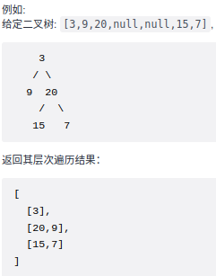

本文记录刷题时总结的代码经验及技巧以及算法等


# 排序算法

> 剑指offer45题， 把数组排成最小的数：输入一个非负整数数组，把数组里所有数字拼接起来排成一个数，打印能拼接出的所有数字中最小的一个。
>
> 输入：[10,2]
>
> 输出：“102”

这道题有两种解法：

第一种，也是相对简单的一种使用内置的sort函数，并自定义一个比较大小的规则，将数组排列为从小到大的顺序并转成字符串。

排序规则： "10" + "2" < "2" + "10"，则2在10之前，即选择使得相加之后的字符串更小的排序方式。**这里注意如何在sort函数中使用自定义的规则（最下面的注释中也是一个方式）**

```cpp
class Solution {
public:
    struct cmp { bool operator()(string& a,string& b) {return a+b < b+a;} };
    string minNumber(vector<int>& nums) {
        vector<string> vec;
        string res;
        for (int a : nums) {
            vec.push_back(to_string(a));
        }
        sort(vec.begin(), vec.end(), cmp());
        for (string a : vec) {
            res.append(a);
        }
        return res;
    }
};
// sort(vec.begin(), vec.end(), [](string& x, string& y){ return x + y < y + x; });
```

第二中：自己写一个快速排序算法。**知识点：快速排序**

```cpp
class Solution {
public:
    string minNumber(vector<int>& nums) {
        vector<string> strs;
        for(int i = 0; i < nums.size(); i++)
            strs.push_back(to_string(nums[i]));
        quickSort(strs, 0, strs.size() - 1);
        string res;
        for(string s : strs)
            res.append(s);
        return res;
    }
private:
    void quickSort(vector<string>& strs, int l, int r) {
        if(l >= r) return;
        int i = l, j = r;
        while(i < j) {
            while(strs[j] + strs[l] >= strs[l] + strs[j] && i < j) j--;
            while(strs[i] + strs[l] <= strs[l] + strs[i] && i < j) i++;
            swap(strs[i], strs[j]);
        }
        swap(strs[i], strs[l]);
        quickSort(strs, l, i - 1);
        quickSort(strs, i + 1, r);
    }
};
```


# 二分查找

> 540题有序数组中的单一元素：给你一个仅由整数组成的有序数组，其中每个元素都会出现两次，唯有一个数只会出现一次。请你找出并返回只出现一次的那个数。
>
> 输入: nums = [1,1,2,3,3,4,4,8,8]
> 输出: 2

```cpp
class Solution {
public:
    int singleNonDuplicate(vector<int>& nums) {
        int low = 0, high = nums.size() - 1;
        while (low < high) {
            int mid = (high - low) / 2 + low;
            if (nums[mid] == nums[mid ^ 1]) {
                low = mid + 1;
            } else {
                high = mid;
            }
        }
        return nums[low];
    }
};
```

这道题记录下来的主要原因在于`nums[mid] == nums[mid^1]`这里，因为这个数组当mid为奇数时需要与mid - 1比较，为偶数时需要与mid + 1比较，于是就可以用这种方法来简便地表达。

对于奇数a, a ^ 1 = a - 1；对偶数a, a ^ 1 = a + 1;


# 二叉树

## 层序遍历

最简单版：返回值为`vector<int>`，直接用`queue<TreeNode*>`，前面pop后面push即可

升级版：返回值为`vector<vector<int>>`，要求按每层一个vector的格式返回，那么只需要在每层开始的时候增加一步记录一下当前queue的size即可。

再升级：在上一题的基础上要求偶数层正着，奇数层反着，打印顺序交替变化。将queue改为deque，deque可以在前后两侧都实现push和pop。再加一个bool变量控制是正序还是逆序。注意正序逆序的情况处理左右节点的顺序是反着的。




## 平衡二叉树

> 判断一棵树是否为平衡二叉树，输入一棵二叉树的根节点，判断该树是不是平衡二叉树。如果某二叉树中任意节点的左右子树的深度相差不超过1，那么它就是一棵平衡二叉树。

```cpp
class Solution {
public:
    int getHeight(TreeNode* cur) {
        if (!cur) return 0;
        int left = getHeight(cur->left);
        if(left == -1) return -1;
        int right = getHeight(cur->right);
        if(right == -1) return -1;
        return abs(left - right) > 1 ? -1 : 1 + max(left, right);
    }
    bool isBalanced(TreeNode* root) {
        return getHeight(root) == -1 ? false : true;
    }
};
```

利用递归的方式求解


## 二叉树的最近公共祖先

> 给定一个二叉树, 找到该树中两个指定节点的最近公共祖先

```cpp
class Solution {
    public TreeNode lowestCommonAncestor(TreeNode root, TreeNode p, TreeNode q) {
        if (root == null || p == root || q == root) {
            return root;
        }

        TreeNode l = lowestCommonAncestor(root.left, p, q);
        TreeNode r = lowestCommonAncestor(root.right, p, q);
    
        return l == null ? r : (r == null ? l : root);
        // l = null 意味着p,q不在左子树，所以return r，对另一侧同理
        // l, r都不为null意味着一个在左一个在右，因此return root
        //不会出现左右都为null的情况
    }
}
```


# 数学

## 约瑟夫环问题

> 0,1,···,n-1这n个数字排成一个圆圈，从数字0开始，每次从这个圆圈里删除第m个数字（删除后从下一个数字开始计数）。求出这个圆圈里剩下的最后一个数字。
>
> 例如，0、1、2、3、4这5个数字组成一个圆圈，从数字0开始每次删除第3个数字，则删除的前4个数字依次是2、0、4、1，因此最后剩下的数字是3。
>

```cpp
class Solution {
public:
    int lastRemaining(int n, int m) {
        int x = 0;
        for (int i = 2; i <= n; i++) {
            x = (x + m) % i;
        }
        return x;
    }
};
```

思路解析：

于「n,m」问题，首轮删除环中第 m 个数字后，得到一个长度为 n−1的数字环。删除的数字为 (m−1)%n，删除后的数字环从下个数字（即 m%n）开始，设 t=m%n，可得数字环
t,t+1,t+2,...,0,1,...,t−3,t−2

删除一轮后的数字环也变为一个「n−1,m」问题，并有以下关系：x -> (x+t)%n，因此有
$$
f(n) = (f(n - 1) + t) \% n  \\
     = (f(n - 1) + m \% n) \% n \\
     = (f(n - 1) += m) \% n
$$
所以可以用动态规划求解：

dp[i] = (dp[i - 1] + m) % i


