# Lecture 1

## Q1: 什么是old school planning pipeline？什么是end-to-end navigation？二者的区别是什么？

old school planning pipeline：

（1）Front-end path finding: Search for an initial safe path; Low dimensional; Discrete space.

（2）Back-end trajectory generation: Search for an executable trajectory; High dimensional; Continuous space.

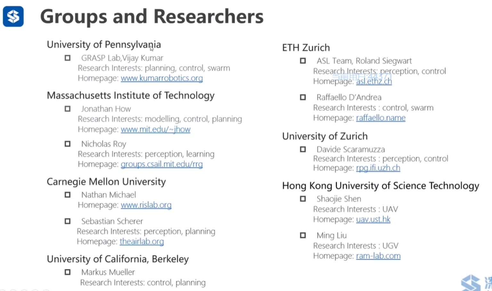

## Q2: Soft and Hard constrained Trajectory optimization

Soft constrain: 加在优化函数上，但不一定满足

Soft constrain: 数学上一定满足

## Q3：Map = Data Structure + Fusion Method

### 1. Occupancy grid map 占用栅格地图

Most dense; Structural; Direct index query

稠密，直接索引（复杂度为1）

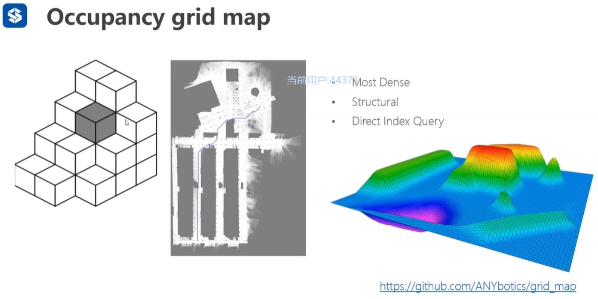

### 2. Octo-map 八叉树地图

Sparse; Structural; Indirect index query

有障碍物的地方才继续细分

栅格地图数据量大，内存占用量大，在很多无用的地方也划分了栅格，为了优化这个问题，出现了八叉树地图

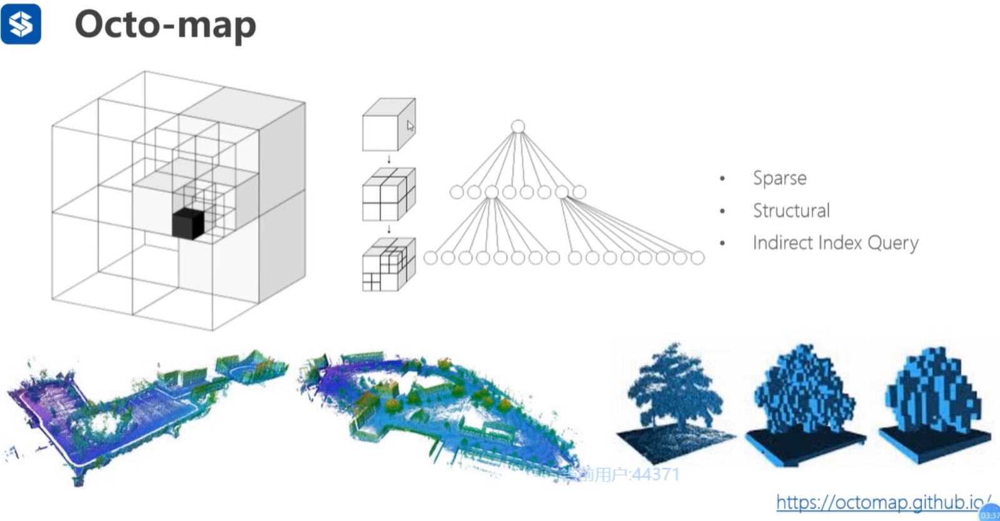

### 3. Voxel hashing 体素哈希地图

Most sparse; Structural; Indirect index query

对障碍物的边界用哈希表存储

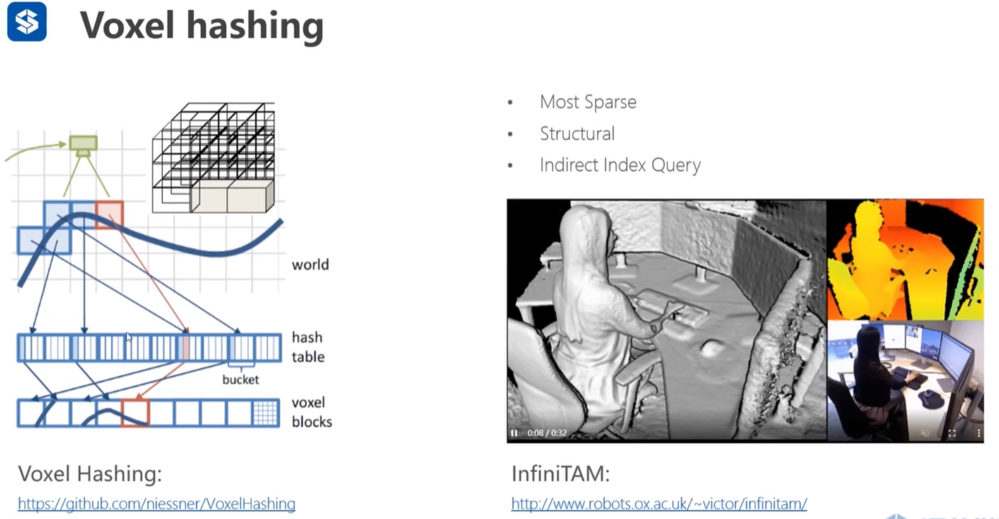

### 4. Point cloud map

Unordered; No index query

### 5. TSDF map 

Truncated Signed Distance Functions

障碍物外的点用一个正值表示，其值为与障碍物边界之间的距离

障碍物内的点认为都是障碍物，用负值表示，其值为与障碍物边界之间的距离

Truncated表示只关注一定范围内的点

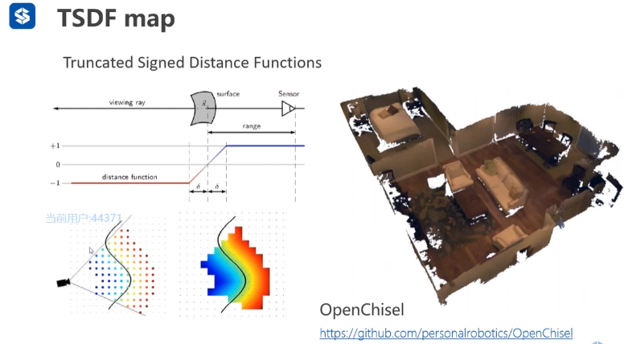

### 6. ESDF map

Eulidean Signed Distance Functions  欧式距离场

与TSDF区别：不截断，也就是区域内的点都要

这样做的优势主要是可以用来做轨迹优化，评估障碍物的梯度场

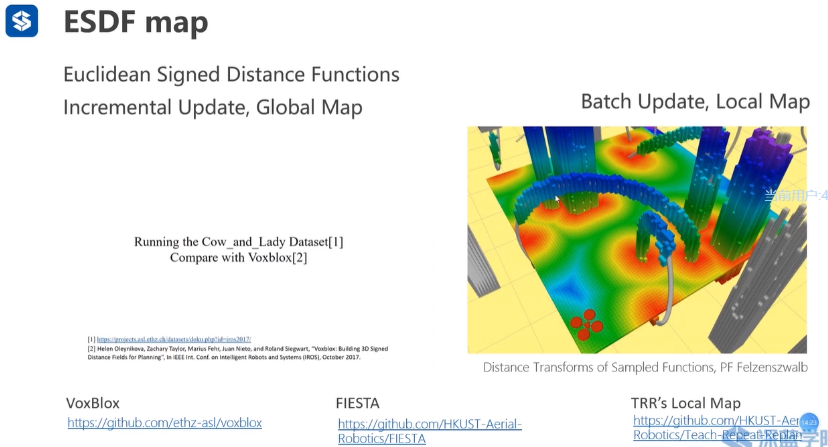

### More

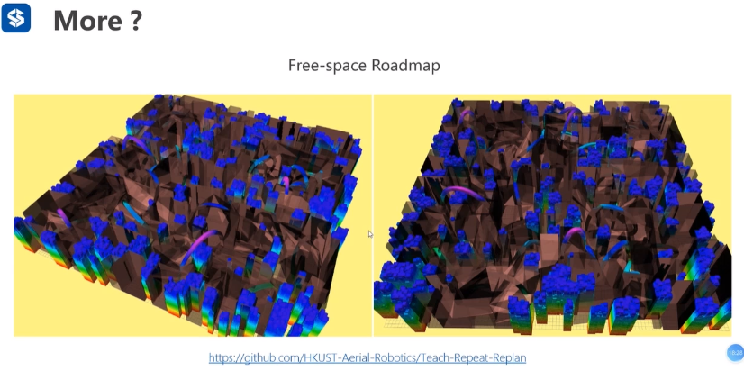

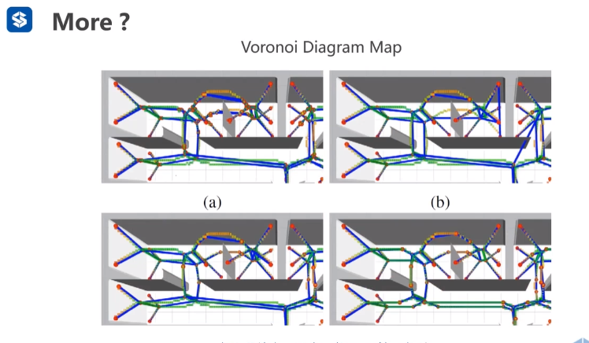

# Lecture 2 Search-Based Path Finding

## 1. Graph Search Basis

---

### Graph Search Overview:

- Container: store all the nodes to be visited.
- Container is initialized with the start state.
- Loop: 弹出、扩展、推入
  - Remove a node from container
    - Visit a node
  - Expansion all neighbors of the node
  - Push neighbors into container
- End loop

---

### Questions:

- 什么时候结束循环？
- 如果图是cyclic的怎么办？
- 如何尽快到达目标点？

## 2. Graph Traversal

- Breadth First Search (BFS, 广度优先搜索)
- Depth First Search (DFS, 深度优先搜索)

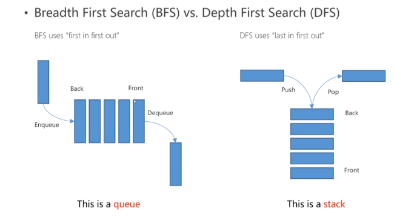

队列：先进先出；堆栈：后进先出
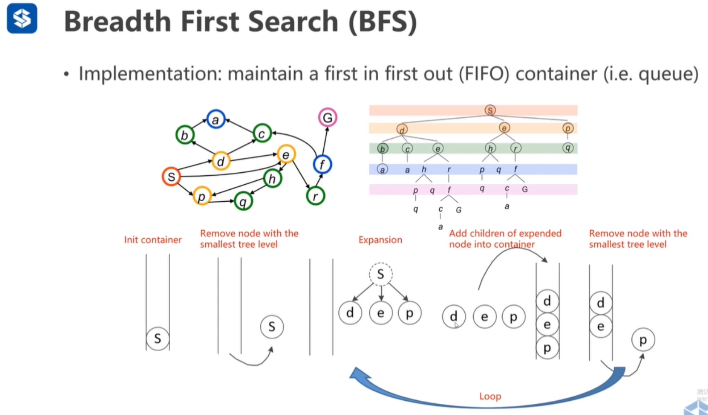

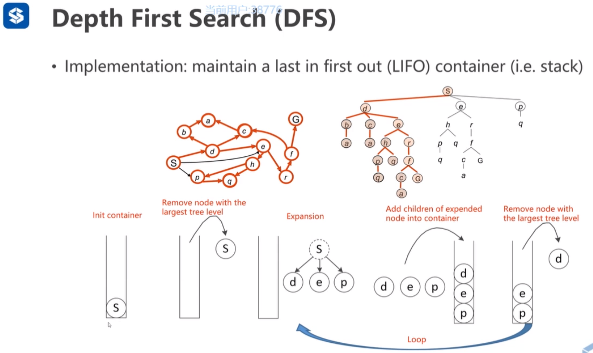

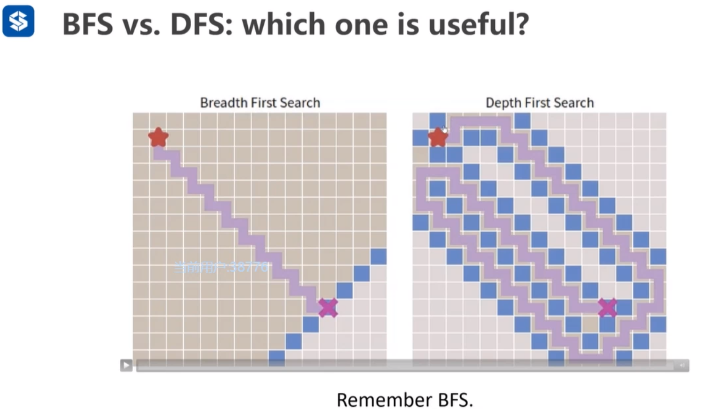

**BFS作为图搜索的基础**

## 3. Heuristic search

### Greedy Best First Search 贪心算法

BFS与DFS的区别：弹出的是 first in 还是 last in

而贪心算法弹出的节点是**根据人所定义的规则而弹出**，这个规则就称为heuristic。

A heuristic is a **guess** of how close you are to the target.

贪心算法因为具有目的性，因此搜索路径往往更快，但很容易陷入局部最优

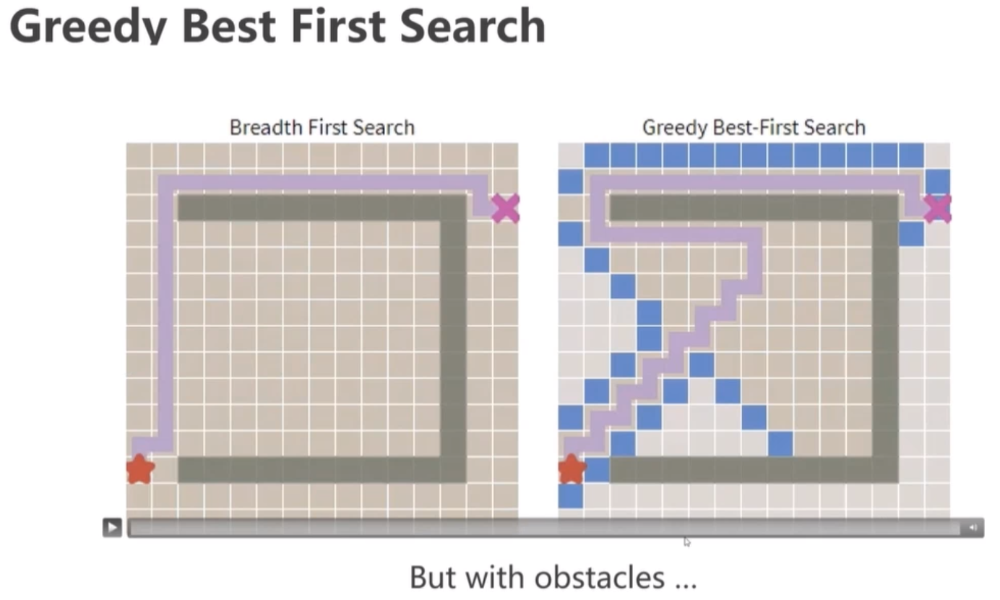

## 4. Dijkstra and A*

如果图的边的权重都为1，那么BFS可以找到最优的一条路径，但如果边的权重不都相同，怎么尽快找到一条cost最小的路径呢？

### Dijkstra

Strategy: visit the node with cheapest accumulated cost g(n)

当所有边的代价都为1的时候就相当于BFS

### A*: Dijkstra with a Heuristic

f(n) = g(n)+h(n)

Heuristic h(n): estimated least cost from node n to goal state.

要保证A *的最优性，就要使得A *在每个点Heuristic的值是小于真实的到终点的cost的

因此，h越小就越好，当h=0，就退化成了Dijkstra算法。

当然，因此也就出现了Sub-optimal Solution，追求求解速度而牺牲最优性

Weighted A * : f = g + εh  ε>1 等于说bias towards states that are closer to goal.

#### 工程实现上的经验

#### 如何评价一个Heuristic的好与坏呢

采用不同的Heuristic，最后扩展 的节点数量是完全不一样的，因此扩展的节点数量越少，则占用的储存空间越少，Heuristic就越好。对于二维的路径搜索而言，存在一个可计算的值，如下图右侧所示。将这个式子作为Heuristic，可以有效地减少需要扩展的节点数量。

#### Tie Breaker

打破路径中的对称性。最短的路径长度可能有很多的实现方式，但我们可能更希望其中一种方式，或者有打破对称性之后需要扩展的节点更少，因此可以采用修改h函数的方式打破对称性，让每个点的h都不一样，需要扩展的节点量就会改变。

## Jump Point Search (JPS)

系统性的Tie Breaker方法，与A*的区别在于怎么找邻接点。

注意上图中的三种点，分别是inferior neighbors(灰色), natural neighbors(白色), forced neighbors(红色).

**JPS的思想：**

- 一直沿着同一个方向扩展、跳点，不轻易的选择其他路径（其他路径必定cost更高或相等）。
- 常规情况：灰色的就是不考虑的点，白色的点就是需要考虑的点。
- 直到遇到障碍物，出现forced neighbors，也就是红色点。红色表示父节点到达这一节点必须要经过我，否则cost更高。

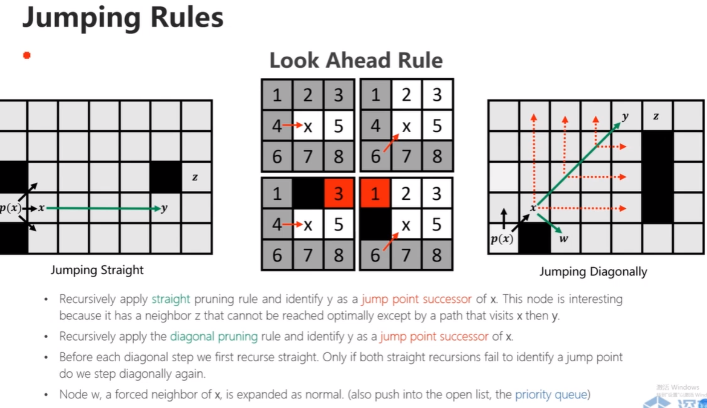

**JPS的规则：**

- 递归地沿水平、垂直方向扩展、跳点。直到遇到障碍物或forced neighbor。
  - 如果遇到障碍物，向对角方向移动一格
  - 如果遇到forced neighbor，将其放入open list

整体流程（伪代码）其实与A *相同，主要区别在于如何扩展节点

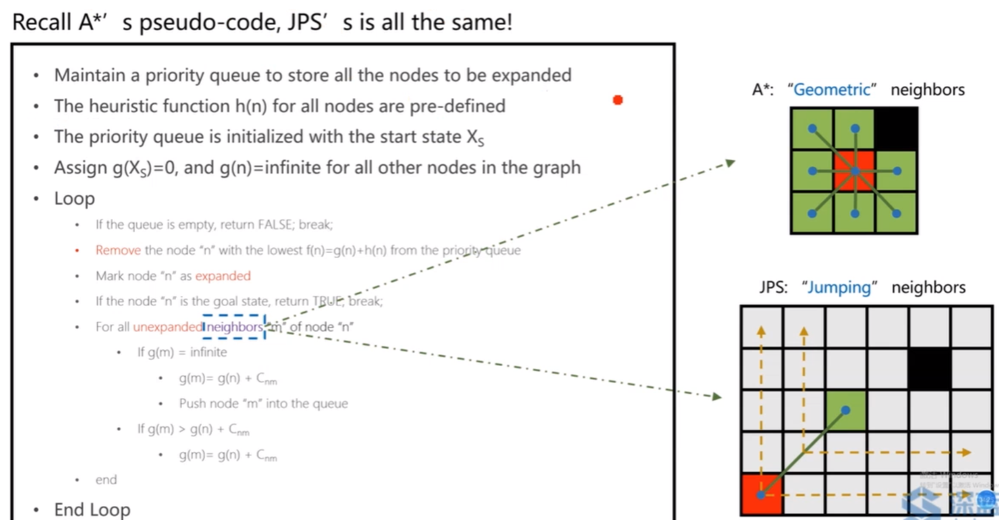

下面是规划的结果距离：其中灰色的是途径的标记出来的关键节点，紫色的是放入了open list但还没访问的点（已结束不需要访问了）

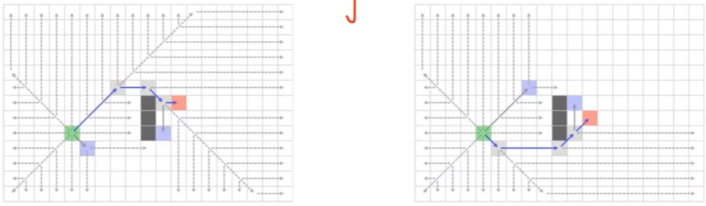

# Lecture 3 Sample-Based Path Finding

随机撒点然后连线，更加高效，适用于三维或者更高维的复杂空间

Complete Planner（完备的规划器）：总能在有限的时间里找到一个规划的轨迹

Probabilistic Complete Planner（概率完备的规划器）：如果解存在，规划器最终将通过随即采样找到

Resolution Complete Planner：基于deterministic sampling （比如在一个fixed的栅格上采样）

## Probabilistic Road Map

- Learning phase
  - Sample N points in C-space
  - Delete points that are not collision-free
  - Connect to nearest points and get collision-free segments
  - Delete segments that are not collision free
- Quert phase
  - Search on the road map to find a path from the start to the goal (Using Dijkstra or A *)
  - Road map现在就类似于一个栅格地图，或者说是简化版的grid map 

**Pros and Cons**

优点：

- 概率完备

缺点

- Required to solve 2 point boundary value problem（运动学约束，要解决两点之间机器人的运动问题，如何从一点到一点）
- Build graph over state space but no particular focus on generating path
- 低效

**改进**

- Lazy collision-checking
  - 检查点是否在障碍物内其实是非常耗时的过程，特别是在复杂或者高维环境中
  - 采点、生成segments不考虑碰撞（也就是lazy）
  - 如果必要（也就是生成了一条穿过障碍物的路径），那就删除对应的edge和node，重新path finding

  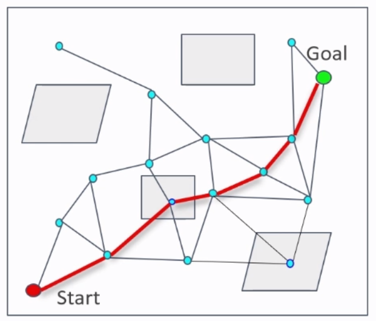

## Rapidly-exploring Random Tree (RRT)

Step1: 黄色高亮——生成随机点

Step2: 在已有的树中找到离新随机点最近的点（需要用到KD-Tree）

Step3: 向前迈进一小步

Step4: 将新的点和边加入树中

 RRT在狭窄环境下可能会出现问题  (树总是在一侧扩散，很难经过中间的缝隙，这可能对我的项目影响比较大)

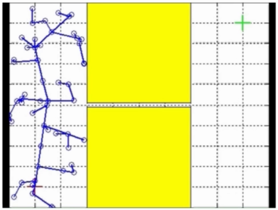

### Bidirectional RRT / RRT Connect

采一个点，从起始点和终止点同时构建两颗树

对上述的狭小空间十分有帮助，但也有人通过改进采样的方式来提高RRT的表现

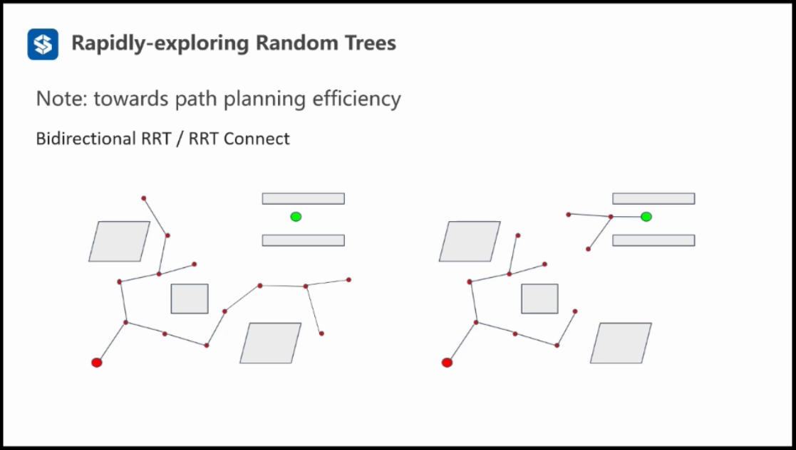

## Optimal sampling-based path planning methods

### RRT * ：针对性解决RRT生成路径不是最优的问题

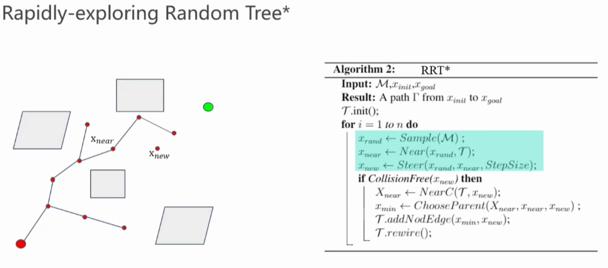

改进：

- 在x_new附近找出已有的几个点，分别计算到x_new的cost，cost最小的为x_new的父节点并增加edge。

- Rewire()函数：对新生成点附近的点的路径进行重构和剪枝等， 生成一条更短的路径

### Kinodynamic-RRT * ：改变Steer()函数，不再用直线连接，而用符合机器人运动学约束的线段来连接。

### Anytime-RRT *：机器人在移动的同时仍然在更新路径，起始点变为机器人当前的位置

## Advanced Sampling-based Methods 对于采样方式的改进

### Informed RRT *：把采样的过程限制在了一个椭圆里面

椭圆的生成：以起点和终点为焦点，以目前生成的轨迹长度为“椭圆上的点到两个焦点间距离的和”

### Cross-entropy motion planning：

- 在已生成的轨迹节点周围采样（多高斯模型）
- 对新采样的几条轨迹上的节点，分别计算均值，又得到新的六个点的高斯分布（下方中间的图）
- 再进行采样和计算均值

### Others：见课件pdf

## Implementation

### Open Motion Planning Library OMPL（偏向于机械臂？）

与Moveit with ROS联合使用

### Navigation stick：分为global planner和local planner

# Lecture 4 Kinodynamic Path Finding

为什么要kinodynamic path finding

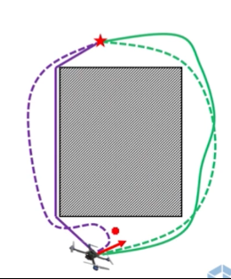

## 4.1 State Lattice Planning

### 背景知识介绍：

**路径规划主要分为正向和逆向两种方法**

- 正向是离散控制空间，也就是说给控制输入，往前走，例如A *算法就是一种；无目的性，效率低，但好实现
- 逆向是离散状态空间，也就是给出状态点，找控制输入，例如PRM；有目的性，效率高，但难实现

**无人机模型如下面图左侧部分所示**

这张PPT的目的是阐述如何离散一个control space，得到一个feasible motion connection

右上方的两块是在飞机给定一个初始状态时输入不同的控制输入，得到的最终结果

下面是将无人机的运动学模型扩张到更高维度，得到一个多阶积分器

状态转移矩阵如下，可以得到具体的轨迹

### State lattice 

Lattice graph：从上面那个图扩展而来，在控制空间做离散化

在状态空间做离散化

##  4.2 Boundary Value Problem (BVP)

给定初始和末尾的位置和状态，希望对这段轨迹进行参数化（用一个多次函数来拟合），于是就可以得到一个高次方程组。该方程组一般不止有一个解，因此就涉及到下面一个问题

### Optimal Boundary Value Problem (OBVP)

（要用到*Pontryain*'s minimum principle 庞特里雅金最小值原理）

给定初始状态和末尾状态，目标是求运动过程中jerk的积分最小

（这部分较复杂，笔记见Notability/组会/进度规划/路径规划）

### Planning in Frenet-serret Frame

Frenet活动坐标系：在自动驾驶中，希望汽车沿着车道线前进，于是可以把坐标系变为沿着车道线的轴和垂直于车道线的轴

## 4.3 Hybrid A * 算法 & Kinodynamic RRT * 算法 

实时kinodynamic path planning算法

### Hybrid A *算法

Lattice graph对control space离散的缺点：Lattice graph很容易在某一个区域整体都不行，同时为了一定有解，lattice graph可能会分的很稠密。

于是想把栅格地图的A *算法和lattice graph结合在一起，选择control input并积分，且保证栅格里只有一个state。如果新节点与旧节点在同一个栅格里，且cost更小，则更新栅格内的节点。

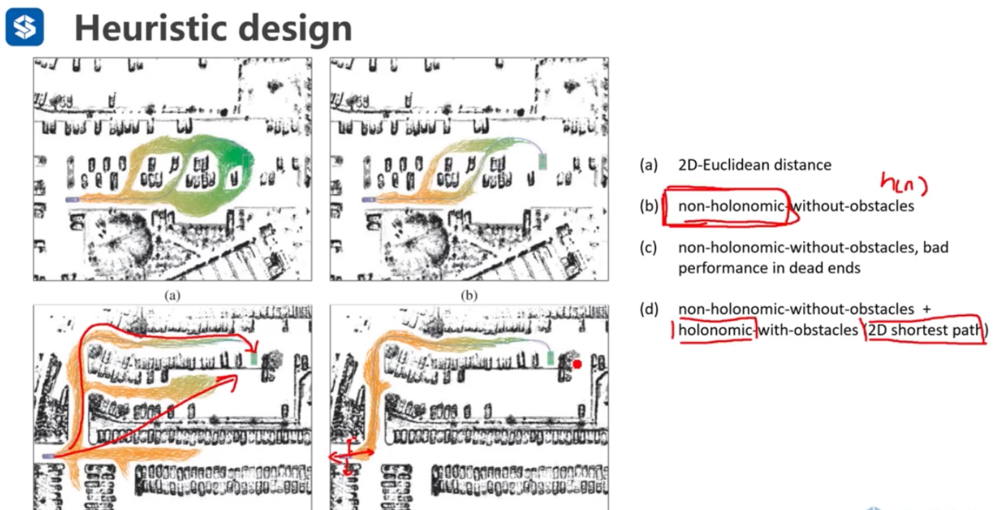

启发式函数的选择：考虑运动学但不考虑障碍物+考虑障碍物但不考虑运动学

无人机模型的幂零性质，状态转移时的闭式函数？是什么意思？怎么带来的便利？我可以用么？ 

###  Kinodynamic RRT * 算法 

与RRT *的区别：在rewire()的时候，连线不再是直线，而是要考虑运动学约束，解BVP方程的

1. 如何采样：包含更多的状态、更高维度
2. 如何定义Near：cost最小，时间最小等等 
3. 如何确定父母节点的范围：一个圈，圈的大小表示cost大小，限定cost
4. 如何寻找最近点：KD-tree

# Lecture 5 Minimum snap trajectory generation

Old school 的path planning：见最开头

那么为什么要smooth trajectory呢？

- Good for autonomous moving
- 速度或者高阶动力学不能change immediately
- 机器人不能在转折处停下来
- save energy

## Differential Flatness 及其证明

含义：The states and the inputs 可以用“平坦（flat）的输出变量及其导数”的algebraic函数表示。

应用：Any smooth trajectory in the space of flat outputs (with reasonably bounded derivatives) can be followed by the under-actuated quadrotor.

常规无人机的状态空间有12维，挑选出4维 
$$
X = [x,y,z,\phi,\theta,\psi,\dot{x},\dot{y},\dot{z},\omega_x,\omega_y,\omega_z]^T \\
\sigma = [x, y, z, \psi]^T
$$
Trajectory in the space of flat outputs: 
$$
\sigma(t) = [T_O, T_M] -> R^3 \times SO(2) 
$$
（含义：时间To到Tm，三维空间+yaw单一旋转空间）

Nolinear quadrotor dynamics
$$
\begin{align*}
& Newton \ Equation:
m \ddot{p} = \left[\matrix{0\\0\\-mg}\right] + R \left[\matrix{0\\0\\F_1+F_2+F_3+F_4}\right] \\
& Euler \ Equation:
I \cdot \left[\matrix{\dot{\omega_x}\\\dot{\omega_y}\\\dot{\omega_z}}\right] + 
\left[\matrix{\omega_x\\\omega_y\\\omega_z}\right]
\times I \cdot
\left[\matrix{\omega_x\\\omega_y\\\omega_z}\right]
= \left[\matrix{l(F_2-F_4)\\l(F_3-F_1)\\M_1-M_2+M_3-M_4}\right] \\ \\ \\
& Equation \ of \ motions: \\
& m \ddot{p} =-mg z_W + u_1 z_B \\
& \omega_B = \left[\matrix{\omega_x\\\omega_y\\\omega_z}\right], \  
\dot{\omega_B} = I^{-1}[-\omega_B \times I \cdot \omega_B + \left[\matrix{u_2\\u_3\\u_4}\right]]

\end{align*}
$$
接下来要证明确实可以用四个变量表示十二个状态，接下来规划就只需要在四维状态中进行

 欠驱动系统无人机的姿态一定是与加速度耦合的，因此在planning的时候对姿态和加速度只能二选一进行planning，又因为姿态具有强非线性，因此一般选择对加速度planning，然而全驱动系统不是 

 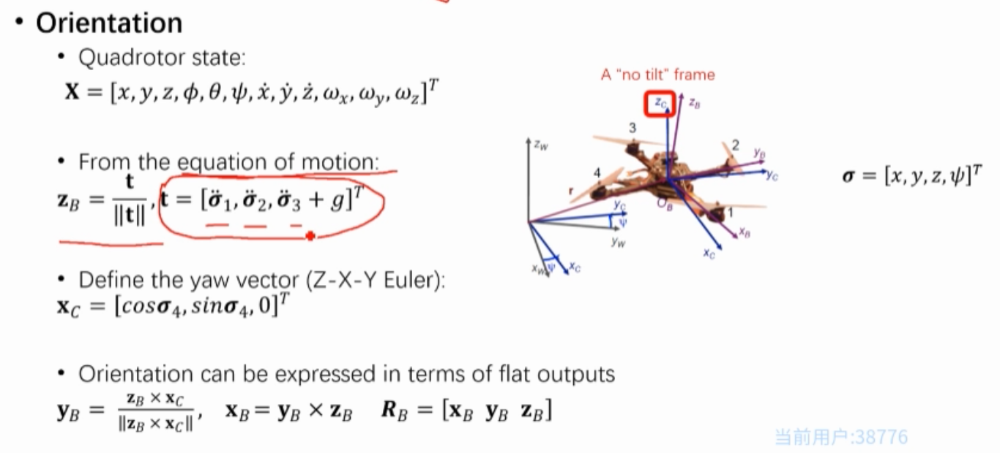

Body坐标系就确定了，那么三个角度也就确定了，那么我们先搞定Body坐标系，

X_W表示世界坐标系，引入中间坐标系X_C，与X_W相差一个yaw角，于是有上图最下面的关系，可求出y_B, x_B 

接下来求角速度状态变量，通过叉乘点乘等方法可以消除化简得到

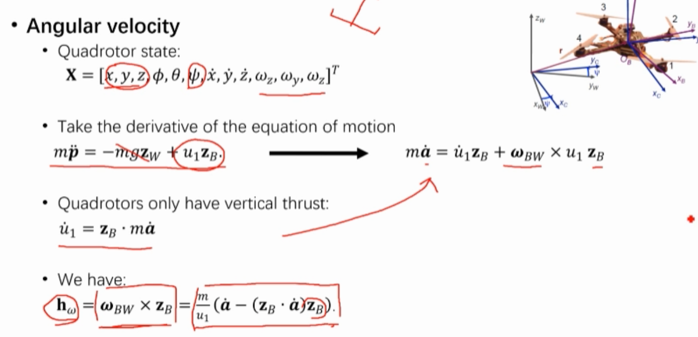

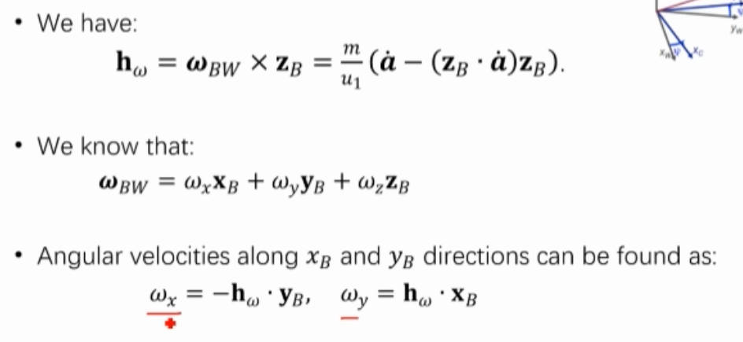

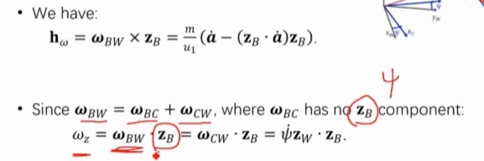

至此，已经完成了微分平坦性的证明

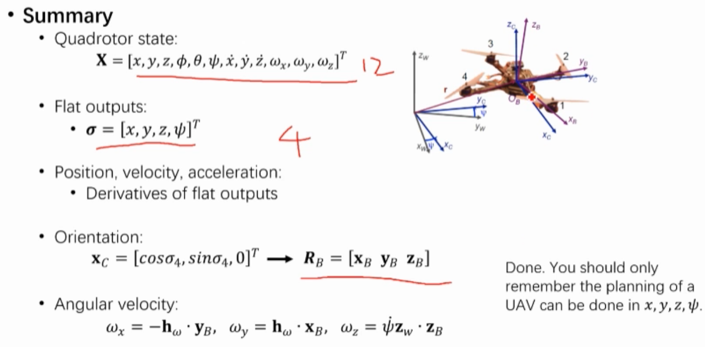

## Polynomial Trajectories

- Easy determination of smoothness criterion with polynomial orders
- Easy and closed form calculation of derivatives
- Decoupled trajectory generation in three dimensions

## Minimum-snap

**Smooth 1D Trajectory**

Just a simple BVP, 5th order polynomial

**Smooth Multi-Segment Trajectory**

每一段的首尾增加了速度约束，但是速度约束或加速度约束不应该是人为给定的，于是就要用优化的方法来确定这些值。

**Smooth 3D Trajectory**

- Boundary condition: start, goal positions
- Intermediate condition: waypoint positions
  - Waypoints by path planning
- Smoothness criterion
  - Generally minimizing change rate of input

**Optimization-based Trajectory Generation**

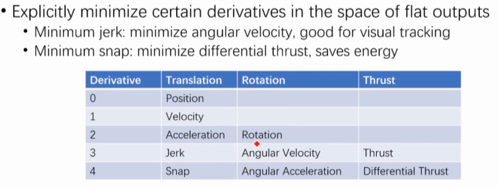

最后我们期望生成的就是一个多段最小snap的轨迹

**Minimum Snap Trajectory Generation**

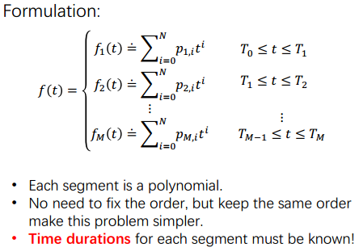

1. 阶数的确定：

- Minimum jerk: N = 2 * 3 - 1 = 5, 2*3表示首尾的位置、速度、加速度变量，所以多项式要有6个变量，因此对应五次多项式
- Minimum snap: N = 2 * 4 - 1 = 7

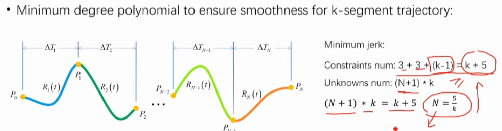

对于k段轨迹而言，首尾点提供位置、速度、加速度等，中间点只提供位置约束，速度加速度等都是优化出来的，因此按照上图可以计算出来每一段轨迹所需要的阶数N。同时可以知道，轨迹的分段数越多，每一段所需要的阶次约低。

一般都按照最坏的情况，也就是k=1进行计算

2. 计算cost function

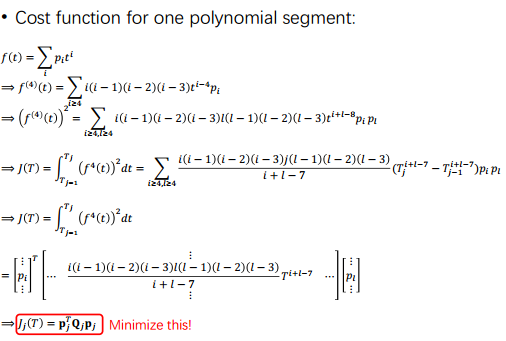

3. 定义约束

- Derivative constraint 起点终点的位置、速度、加速度的值约束

$$
\begin{align*}
& f_j^{(k)}(T_j) = x_{j}^{(k)}  \\
& x(t) = p_5 t^5 + p_4 t^4 + p_3 t^3 + p_2 t^2 + p_1 t + p_0 \\
&第j段轨迹: \\
& p_{j,5} T^5 + p_{j,4} T^4 + p_{j,3} T^3 + p_{j,2} T^2 + p_{j,1} T + p_{j,0} = x_{T,j} \\
& 5p_{j,5} T^4 + 4p_{j,4} T^3 + 3p_{j,3} T^2 + 2p_{j,2} T + p_{j,1} = x_{T,j}^{(1)} \\
& \sum_{i \geq k} \frac{i!}{(i-k)!}T_j^{i-k}p_{j,i} = x_{T,j}^{(k)} \\
& \Rightarrow
A_j p_j = d_j
\end{align*}
$$

- Continuity constraint 前一段轨迹的终点与后一段轨迹的起点相同的约束

$$
\begin{align*}
& f_j^{(k)}(T_j) = f_{k+1}^{(k)}(T_j)  \\
&第j段轨迹: \\
& \sum_{i \geq k} \frac{i!}{(i-k)!}T_j^{i-k}p_{j,i} - \sum_{l \geq k} \frac{l!}{(l-k)!}T_j^{l-k}p_{j+1,l} = 0 \\
& \Rightarrow
[A_j -A_{j+1}] \left[ \matrix{p_j \\  p_{j+1}} \right]  = 0
\end{align*}
$$

将两种约束的约束矩阵合起来，那么原本的问题就变成了如下的一个QP问题（Constrained quadratic programming formulation），这是一个典型的convex optimization program
$$
min \left[\matrix{p_1 & ... & p_M} \right] \left[\matrix{Q_1 & 0 & 0 \\ 0 & ... & 0 \\ 0 & 0 & Q_M} \right] \left[\matrix{p_1 \\ ... \\ p_M} \right]   \\
s.t. A_{eq} \left[\matrix{p_1 \\ ... \\ p_M} \right] = d_{eq}
$$

# 考虑姿态优化的全向无人机minimum snap路径规划

Omni_hex是微分平坦的么？

# Lecture 6 Soft and hard constrained trajectory optimization

## Introduction

Minimum snap trajectory optimization:

Minimum snap的优点：

- 可以让机器人在某个时刻抵达某个航点，piecewise
- 在任何一个时间都可以close form的在数学上求解机器人的位置速度加速度以及各阶导数，使得问题形式非常的简单
- 轨迹规划本身可以做到非常efficient，因为把它化成了一个凸优化问题求解，甚至也可以不解这个凸优化问题，通过数学上的变型直接得到一个close form的解

Minimum snap的缺点：

- 航点之间的轨迹overshoot无法避免

因此basic minimum snap framework 适合生成smooth curve，但不利于避障。

那么就要考虑如何修改使他能够避障

- 硬约束：等式/不等式约束，一定要满足
- 软约束：约束方程作为惩罚项/代价函数加入到目标函数中，然后最小化目标函数

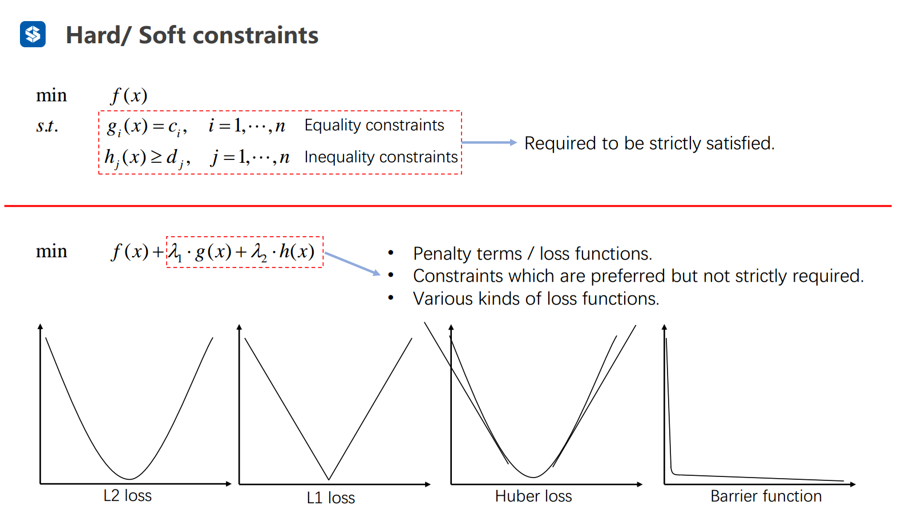

## Hard-constrainted Optimization

Corridor-based Trajectory Optimization 基于走廊的轨迹优化方法

根据障碍物的位置，划分出一个个安全走廊，而约束从“经过一个个路点”变成了“每一段轨迹都要在走廊内”，即从Continuity constraints变成了Safety constraints。

走廊的形状不一定是方块，只要是凸的形状，那就可以化成凸优化的问题。

Instant linear constraints约束连接点在Corridor内，为了保证整段轨迹都在Corridor内，就要用到Interval linear constraints来检查轨迹是否符合边界条件。

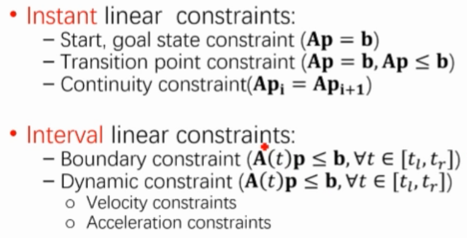

优点：

- 高效：在reduced graph中进行路径搜索，以及在corridor中进行凸优化都很搞笑
- 高质量：corridor提供很大的优化空间

问题：

- 所有的约束都只是暑假在每一段的部分点上，如何保证在整段轨迹上起作用呢？
  - 迭代地检查极值，并施加额外的约束
- Treat all free space equally
- Solution space is sensitive to noise

检查极值是另一个多项式求根的问题

- 对于四次及四次以下的多项式求根，有求根公式很简单
- 更高阶的则就需要用数值方法，参考matlab求极值的方法，用伴随矩阵

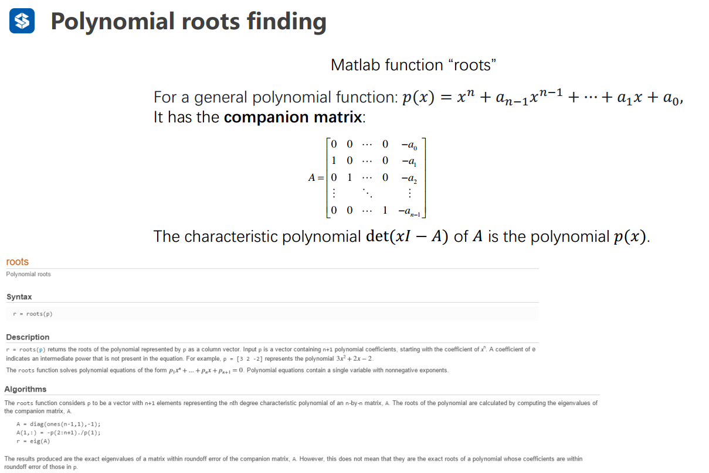

### Bezier Curve Optimization

把普通多项式改成Bernstein多项式，Bernstein多项式中每一项的系数被称为控制点

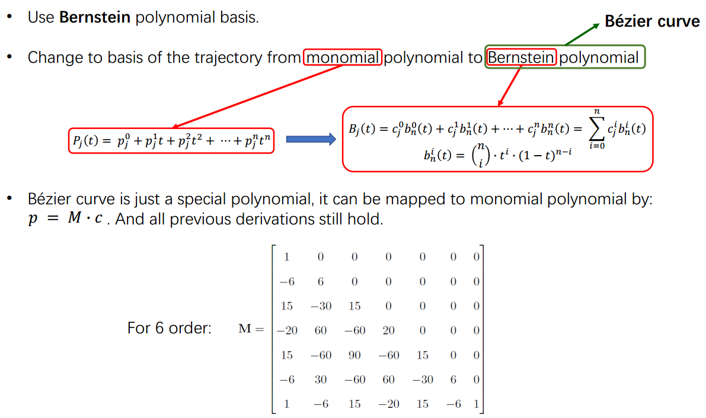

这种多项式的特点是什么呢？

- Endpoint interpolation： 起始于第一个控制点，终止于最后一个控制点，而不经过中间的任何控制点。
- Convex hull凸包性质：贝塞尔曲线被所有控制点形成的凸包完全包住
- Hodograph：贝塞尔曲线B(t)求导后B'(t) 仍然是一段贝塞尔曲线，并且可以用原本的控制点线性表示为n*(c_{i+1} - c_i)，所以要约束导数，那也只需要约束原本的曲线
- Fixed time interval 

由于Convex hull的性质，就可以用于飞行走廊

几阶贝塞尔曲线就有几个控制点，于是就需要几个约束。

可以用凸包性质限制飞机的位置，也就可以用凸包性质限制位置的导数，即速度和加速度

### Dense constraints

 

## Soft-constrained Optimization

### Distance-based Trajectory Optimization

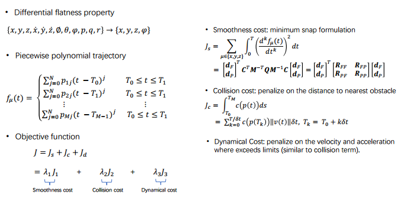

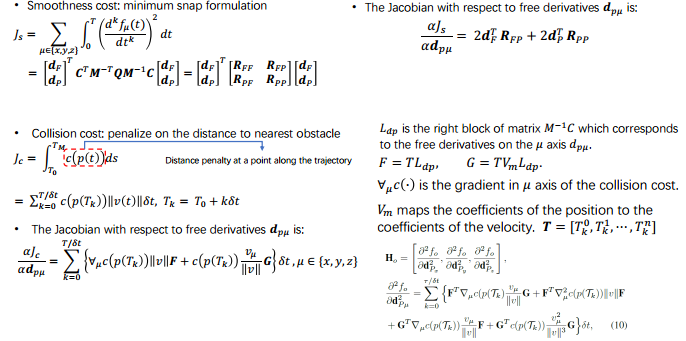

得到目标函数之后就可以按照优化的方法求解了

优化策略：

两步走的策略：先只优化Jc，保证最初始的路径是在离障碍物比较远的位置，再加上光滑项等进行优化

### Fast Planner

前端路径搜索用Hybrid A*

均匀B样条，约束施加在控制点上

elastic band cost function: 轨迹的张力，倾向于把轨迹拉成一条直线

# Lecture 7 MDP-Based Planning 

MDP: 马尔科夫决策过程

## Uncertainties in Planning

Uncertainty可以被分为两类

Nondeterministic: 机器人不知道会受到什么样的uncertainties或者interference（干扰）

Probabilistic: 机器人可以通过观察来估计uncertainties

## Planning with Uncertainties

为了描述概念，引入两个decision makers

- Robot: 主要决策者，performs planning

- Nature: 向机器人的plan执行中添加未知的uncertainties

### One-step planning with uncertainty

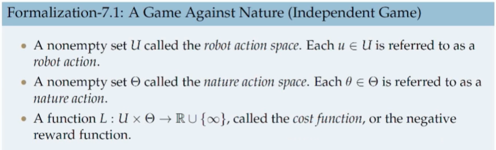

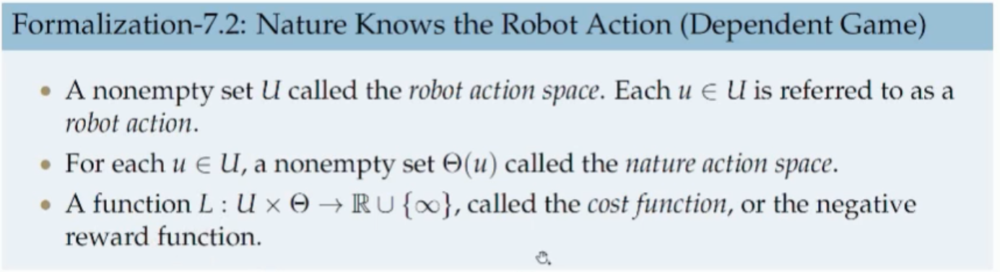

什么是Planning with Uncertainties：在nature参与的情况下，为机器人寻找最优的decision

两种解法：

对worst case做反应

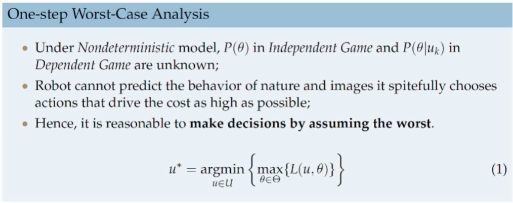

选择执行动作后cost function期望最小的action

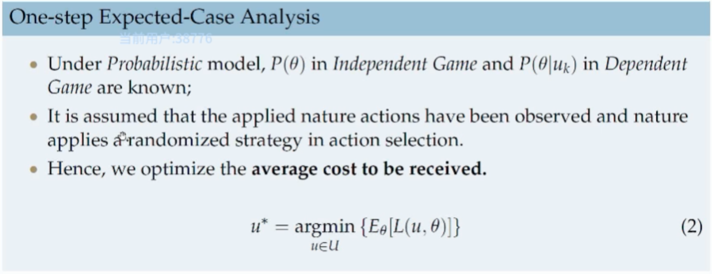

### Multi-step planning with uncertainty

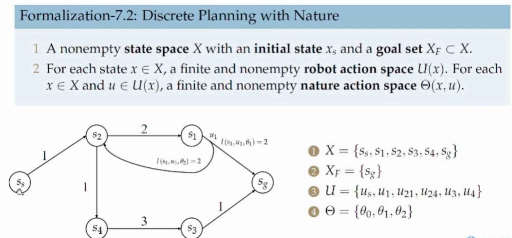

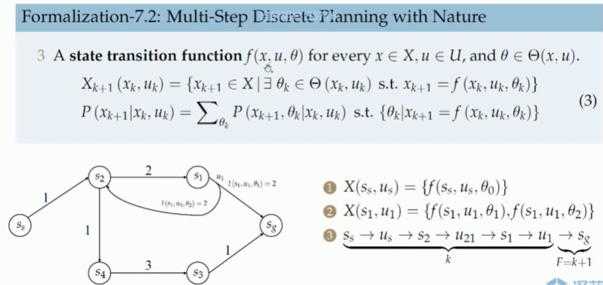

## Markov Decision Process

## Minimax Cost Planning

## Expected Cost Planning

## Real Time Dynamic Programming

# Lecture 8 Motion Planning with Model Predictive Control

## Introduction

Linear MPC与Non-linear MPC的区别：前者解决的问题经常是convex的，后者是non-convex的

MPC:

- Model
  - System model
  - Problem model

- Prediction
  - State space
  - Input space
  - Parameter space

- Control
  - The process of choosing best policy

Optimization

- Searching
  - Graph search
  - Random sampling based
- Convex optimization
  - Quadratic programming
- Nonconvex optimization
  - SQP
  - Particle swarm optimization

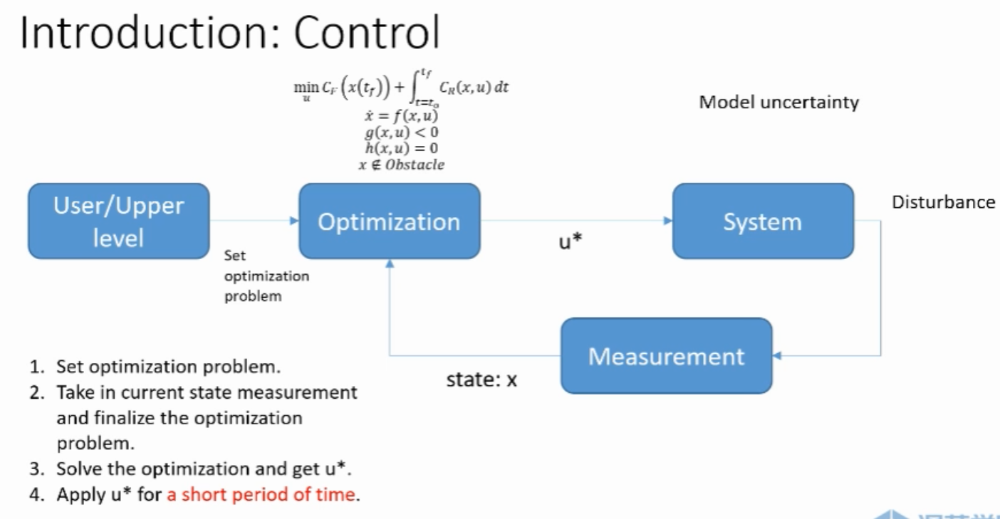

传统MPC的问题在于要求系统的控制频率非常高才能镇定，但对于计算资源有限的系统是不适用的，于是引出了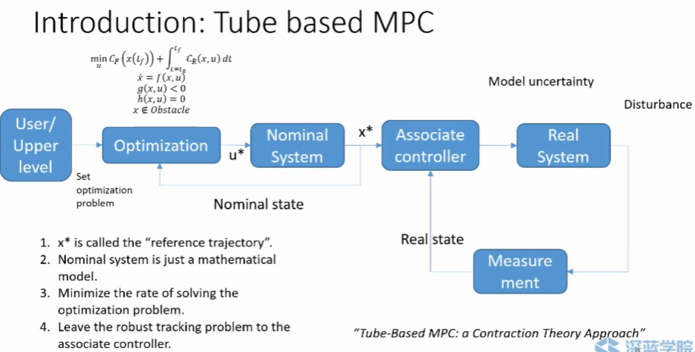

State constraints -> soft constraints

Input constraints -> hard constraints

# To be learned

**Time Base RRT**

NL opt库用于规划算法

# Bottom

